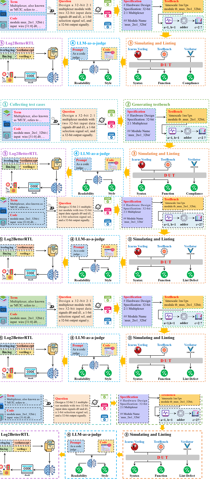

# RTLBench: A Multi-Dimensional Benchmark Suite for Evaluating LLM-Generated RTL Code



---

## 🗂️ Repository Overview

This repository consists of two main components:

- `AutoEval`
  Automated evaluation framework for analyzing RTL code.

- `RTLBench-Benchmark` 
  A comprehensive benchmark suite for assessing code generation capabilities of large language models (LLMs) in RTL design.

---

## 📁 AutoEval Folder Structure

The `AutoEval` directory contains two key submodules:

### 1. `EvalExistBenchmark`

Evaluate the quality of reference RTL code in existing benchmarks.

- **Run Command**:
  ```bash
  python verilatorLint.py
  ```

### 2. `RTLBench`

Use RTLBench-Benchmark to evaluate LLM-generated RTL code.

- **Configuration**:  
  Edit [`api.txt`](./AutoEval/RTLBench/code/api.txt) to set your `API_KEY` and `BaseURL`.

- **Run Command**:
  ```bash
  python main.py
  ```
- **Experimental Results**:
  The experimental results will be stored in the `experiment/model_name/log` folder.
  - `summary_report.txt` file stores the results of the first evaluation.
  - `re_summary_report.txt` file stores the results of Log2BetterRTL post-optimization evaluation.
---

## 🐍 Python Environment

- **Required Version**: Python `3.13.2`

---

## 📦 Dependency Installation

Install project dependencies using the provided [`requirements.txt`](./AutoEval/requirements.txt):

```bash
pip install -r AutoEval/requirements.txt
```

---

## 📬 Contributions

Feel free to open issues or submit pull requests to improve the benchmark suite and evaluation tools.


----
<!DOCTYPE html>
<html lang="en">
<head>
    <meta charset="UTF-8">
    <meta name="viewport" content="width=device-width, initial-scale=1.0">
    <title>Markdown风格表格</title>
    <link rel="stylesheet" href="https://cdnjs.cloudflare.com/ajax/libs/font-awesome/6.4.0/css/all.min.css">
    <style>
        * {
            margin: 0;
            padding: 0;
            box-sizing: border-box;
            font-family: 'Segoe UI', Tahoma, Geneva, Verdana, sans-serif;
        }
        
        body {
            background: linear-gradient(135deg, #f5f7fa 0%, #c3cfe2 100%);
            min-height: 100vh;
            display: flex;
            flex-direction: column;
            align-items: center;
            justify-content: center;
            padding: 20px;
        }
        
        .container {
            max-width: 1000px;
            width: 100%;
            background: white;
            border-radius: 12px;
            box-shadow: 0 10px 30px rgba(0, 0, 0, 0.1);
            overflow: hidden;
            margin: 20px;
        }
        
        .header {
            background: #4f46e5;
            color: white;
            padding: 25px;
            text-align: center;
        }
        
        .header h1 {
            font-size: 28px;
            margin-bottom: 10px;
            display: flex;
            align-items: center;
            justify-content: center;
            gap: 12px;
        }
        
        .header p {
            opacity: 0.9;
            font-size: 16px;
        }
        
        .table-container {
            overflow: auto;
            max-height: 600px;
        }
        
        table {
            width: 100%;
            border-collapse: collapse;
            font-size: 16px;
        }
        
        th {
            background: #f8fafc;
            color: #4f46e5;
            font-weight: 600;
            padding: 18px 15px;
            text-align: center;
            position: sticky;
            top: 0;
            box-shadow: 0 2px 3px rgba(0,0,0,0.1);
            font-size: 17px;
        }
        
        td {
            padding: 15px;
            text-align: center;
            border-bottom: 1px solid #e2e8f0;
            color: #475569;
        }
        
        tr:nth-child(even) {
            background: #f8fafc;
        }
        
        tr:hover {
            background: #f1f5f9;
            transition: background 0.2s;
        }
        
        .category-link {
            color: #000;
            font-weight: 600;
            cursor: pointer;
            padding: 5px 10px;
            border-radius: 6px;
            display: inline-block;
            transition: all 0.3s ease;
        }
        
        .category-link:hover {
            color: #4f46e5;
            background: #eff6ff;
            transform: translateY(-2px);
        }
        
        .count {
            display: inline-block;
            background: #4f46e5;
            color: white;
            padding: 4px 10px;
            border-radius: 20px;
            font-size: 14px;
            font-weight: 500;
        }
        
        .footer {
            padding: 20px;
            text-align: center;
            background: #f8fafc;
            color: #64748b;
            font-size: 14px;
            border-top: 1px solid #e2e8f0;
        }
        
        @media (max-width: 768px) {
            th, td {
                padding: 12px 8px;
                font-size: 14px;
            }
            
            .header h1 {
                font-size: 22px;
            }
            
            .header {
                padding: 20px 15px;
            }
        }
        
        .instructions {
            background: white;
            border-radius: 12px;
            padding: 25px;
            margin-top: 30px;
            max-width: 1000px;
            width: 100%;
            box-shadow: 0 10px 30px rgba(0, 0, 0, 0.1);
        }
        
        .instructions h2 {
            color: #4f46e5;
            margin-bottom: 15px;
            display: flex;
            align-items: center;
            gap: 10px;
        }
        
        .instructions ul {
            list-style: none;
            padding-left: 10px;
        }
        
        .instructions li {
            margin-bottom: 12px;
            padding-left: 30px;
            position: relative;
            color: #475569;
        }
        
        .instructions li:before {
            content: "•";
            color: #4f46e5;
            font-weight: bold;
            position: absolute;
            left: 10px;
        }
    </style>
</head>
<body>
    <div class="container">
        <div class="header">
            <h1><i class="fas fa-table"></i> 数字电路组件分类</h1>
            <p>完整的组件分类及其描述和数量统计</p>
        </div>
        
        <div class="table-container">
            <table>
                <thead>
                    <tr>
                        <th>CATEGORY</th>
                        <th>DESCRIPTION</th>
                        <th>COUNT</th>
                    </tr>
                </thead>
                <tbody>
                    <tr>
                        <td><span class="category-link">Logic Gates</span></td>
                        <td>Basic digital logic gates including AND, OR, NOT, etc.</td>
                        <td><span class="count">8</span></td>
                    </tr>
                    <tr>
                        <td><span class="category-link">Multiplexers</span></td>
                        <td>Select one of many inputs and forward it to the output.</td>
                        <td><span class="count">4</span></td>
                    </tr>
                    <tr>
                        <td><span class="category-link">Demultiplexers</span></td>
                        <td>Route input to one of many outputs.</td>
                        <td><span class="count">4</span></td>
                    </tr>
                    <tr>
                        <td><span class="category-link">Encoders</span></td>
                        <td>Convert input lines into binary codes.</td>
                        <td><span class="count">5</span></td>
                    </tr>
                    <tr>
                        <td><span class="category-link">Decoders</span></td>
                        <td>Convert binary codes into output lines.</td>
                        <td><span class="count">5</span></td>
                    </tr>
                    <tr>
                        <td><span class="category-link">Comparators</span></td>
                        <td>Compare two values and output results.</td>
                        <td><span class="count">3</span></td>
                    </tr>
                    <tr>
                        <td><span class="category-link">Flip-Flops</span></td>
                        <td>Basic memory elements for binary storage.</td>
                        <td><span class="count">5</span></td>
                    </tr>
                    <tr>
                        <td><span class="category-link">Shift Registers</span></td>
                        <td>Serial or parallel data shifting/storage.</td>
                        <td><span class="count">3</span></td>
                    </tr>
                    <tr>
                        <td><span class="category-link">Counters</span></td>
                        <td>Binary/BCD and up/down counters.</td>
                        <td><span class="count">6</span></td>
                    </tr>
                    <tr>
                        <td><span class="category-link">State Machines</span></td>
                        <td>FSM designs for pattern detection/control.</td>
                        <td><span class="count">4</span></td>
                    </tr>
                    <tr>
                        <td><span class="category-link">Memory Modules</span></td>
                        <td>SRAM, DRAM, ROM, and FIFO buffers.</td>
                        <td><span class="count">7</span></td>
                    </tr>
                    <tr>
                        <td><span class="category-link">Arithmetic Units</span></td>
                        <td>Adders, subtractors, multipliers, dividers.</td>
                        <td><span class="count">19</span></td>
                    </tr>
                    <tr>
                        <td><span class="category-link">Floating Point Units</span></td>
                        <td>IEEE 754-compliant arithmetic modules.</td>
                        <td><span class="count">4</span></td>
                    </tr>
                    <tr>
                        <td><span class="category-link">Communication Interfaces</span></td>
                        <td>UART, SPI, and I2C protocol modules.</td>
                        <td><span class="count">8</span></td>
                    </tr>
                    <tr>
                        <td><span class="category-link">Clock & Reset Modules</span></td>
                        <td>Clock division/gating and reset sync.</td>
                        <td><span class="count">9</span></td>
                    </tr>
                    <tr>
                        <td><span class="category-link">DSP</span></td>
                        <td>FIR, FFT, CORDIC digital signal processing.</td>
                        <td><span class="count">11</span></td>
                    </tr>
                    <tr>
                        <td><span class="category-link">Error Detection and Correction</span></td>
                        <td>Detecting/correcting transmission errors.</td>
                        <td><span class="count">7</span></td>
                    </tr>
                    <tr>
                        <td><span class="category-link">Synchronization & Handshake</span></td>
                        <td>Data transfer between async domains.</td>
                        <td><span class="count">4</span></td>
                    </tr>
                    <tr>
                        <td><span class="category-link">Miscellaneous</span></td>
                        <td>Sorting, pulse generation, etc.</td>
                        <td><span class="count">11</span></td>
                    </tr>
                    <tr>
                        <td><span class="category-link">Functional Modules</span></td>
                        <td>Real-world apps: controllers, appliances.</td>
                        <td><span class="count">25</span></td>
                    </tr>
                    <tr>
                        <td><span class="category-link">IO Modules</span></td>
                        <td>General-purpose I/O modules.</td>
                        <td><span class="count">2</span></td>
                    </tr>
                    <tr>
                        <td><span class="category-link">Arbiters</span></td>
                        <td>Manage access to shared resources.</td>
                        <td><span class="count">2</span></td>
                    </tr>
                    <tr>
                        <td><span class="category-link">Converters</span></td>
                        <td>Convert binary to BCD or Gray code.</td>
                        <td><span class="count">1</span></td>
                    </tr>
                    <tr>
                        <td><span class="category-link">Crypto Modules</span></td>
                        <td>AES and SHA cryptographic modules.</td>
                        <td><span class="count">2</span></td>
                    </tr>
                    <tr>
                        <td><span class="category-link">AI Accelerators</span></td>
                        <td>Modules for CNN acceleration.</td>
                        <td><span class="count">1</span></td>
                    </tr>
                </tbody>
            </table>
        </div>
        
        <div class="footer">
            <p>© 2023 Digital Components Library | Last updated: June 2023</p>
        </div>
    </div>
    
    <div class="instructions">
        <h2><i class="fas fa-info-circle"></i> 设计特点</h2>
        <ul>
            <li>表头居中并添加了优雅的样式</li>
            <li>表格行采用斑马纹交替颜色，提高可读性</li>
            <li>分类名称默认黑色，悬停时变为蓝色并轻微上移</li>
            <li>计数使用徽章样式设计，更加醒目</li>
            <li>表格具有悬停效果，提高交互体验</li>
            <li>响应式设计，适应不同屏幕尺寸</li>
            <li>表格头部固定，方便浏览大量数据</li>
        </ul>
    </div>

    <script>
        // 添加简单的交互效果
        document.addEventListener('DOMContentLoaded', function() {
            const rows = document.querySelectorAll('tr');
            
            rows.forEach(row => {
                row.addEventListener('click', function() {
                    this.style.backgroundColor = '#f0f7ff';
                    setTimeout(() => {
                        this.style.backgroundColor = '';
                    }, 500);
                });
            });
        });
    </script>
</body>
</html>
