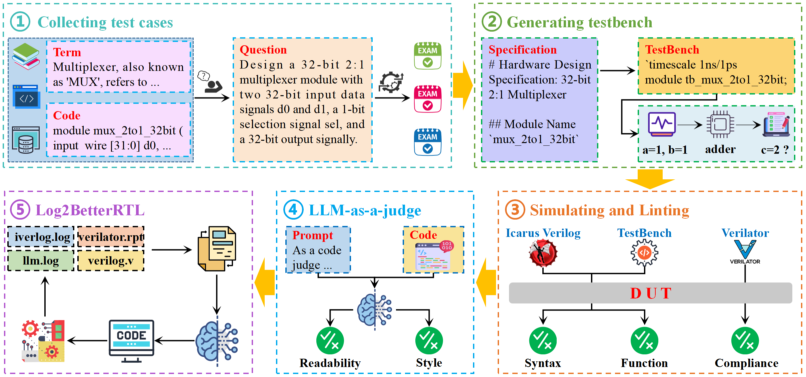

# RTLBench: A Multi-Dimensional Benchmark Suite for Evaluating LLM-Generated RTL Code



---

## 🗂️ Repository Overview

This repository consists of two main components:

- `AutoEval`
  Automated evaluation framework for analyzing RTL code.

- `RTLBench-Benchmark` 
  A comprehensive benchmark suite for assessing code generation capabilities of large language models (LLMs) in RTL design.

---

## 📁 AutoEval Folder Structure

The `AutoEval` directory contains two key submodules:

### 1. `EvalExistBenchmark`

Evaluate the quality of reference RTL code in existing benchmarks.

- **Run Command**:
  ```bash
  python verilatorLint.py
  ```

### 2. `RTLBench`

Use RTLBench-Benchmark to evaluate LLM-generated RTL code.

- **Configuration**:  
  Edit [`api.txt`](./AutoEval/RTLBench/code/api.txt) to set your `API_KEY` and `BaseURL`.

- **Run Command**:
  ```bash
  python main.py
  ```
- **Experimental Results**:
  The experimental results will be stored in the `experiment/model_name/log` folder.
  - `summary_report.txt` file stores the results of the first evaluation.
  - `re_summary_report.txt` file stores the results of Log2BetterRTL post-optimization evaluation.
---

## 🐍 Python Environment

- **Required Version**: Python `3.13.2`

---

## 📦 Dependency Installation

Install project dependencies using the provided [`requirements.txt`](./AutoEval/requirements.txt):

```bash
pip install -r AutoEval/requirements.txt
```

---

## 📬 Contributions

Feel free to open issues or submit pull requests to improve the benchmark suite and evaluation tools.


----
# Category Table (GitHub-friendly)

> GitHub 不支持自定义 CSS，本表采用纯 Markdown + `<details>` 折叠：默认显示前 6 行，其余条目点击展开查看。

| CATEGORY         | DESCRIPTION                                           | COUNT |
|------------------|-------------------------------------------------------|:-----:|
| Logic Gates| Basic digital logic gates including AND, OR, NOT, etc.|     8 |
| Multiplexers     | Select one of many inputs and forward it to the output.|     4 |
| Demultiplexers   | Route input to one of many outputs.                   |     4 |
| Encoders         | Convert input lines into binary codes.                |     5 |
| Decoders         | Convert binary codes into output lines.               |     5 |
| Comparators      | Compare two values and output results.                |     3 |

<details>
<summary><strong>展开查看其余 19 条</strong></summary>

<br>

| CATEGORY                     | DESCRIPTION                                  | COUNT |
|-----------------------------|----------------------------------------------|------:|
| Flip-Flops                  | Basic memory elements for binary storage.    |     5 |
| Shift Registers             | Serial or parallel data shifting/storage.    |     3 |
| Counters                    | Binary/BCD and up/down counters.             |     6 |
| State Machines              | FSM designs for pattern detection/control.   |     4 |
| Memory Modules              | SRAM, DRAM, ROM, and FIFO buffers.           |     7 |
| Arithmetic Units            | Adders, subtractors, multipliers, dividers.  |    19 |
| Floating Point Units        | IEEE 754-compliant arithmetic modules.       |     4 |
| Communication Interfaces    | UART, SPI, and I2C protocol modules.         |     8 |
| Clock & Reset Modules       | Clock division/gating and reset sync.        |     9 |
| DSP                         | FIR, FFT, CORDIC digital signal processing.  |    11 |
| Error Detection and Correction | Detecting/correcting transmission errors. |     7 |
| Synchronization & Handshake | Data transfer between async domains.         |     4 |
| Miscellaneous               | Sorting, pulse generation, etc.              |    11 |
| Functional Modules          | Real-world apps: controllers, appliances.    |    25 |
| IO Modules                  | General-purpose I/O modules.                 |     2 |
| Arbiters                    | Manage access to shared resources.           |     2 |
| Converters                  | Convert binary to BCD or Gray code.          |     1 |
| Crypto Modules              | AES and SHA cryptographic modules.           |     2 |
| AI Accelerators             | Modules for CNN acceleration.                |     1 |

</details>


<table style="width:100%;">
  <thead>
    <tr>
      <th style="text-align:left;">CATEGORY</th>
      <th style="text-align:left;">DESCRIPTION</th>
      <th style="text-align:center;">COUNT</th>
    </tr>
  </thead>
  <tbody>
    <tr><td>Logic Gates</td><td>Basic digital logic gates including AND, OR, NOT, etc.</td><td style="text-align:center;">8</td></tr>
    <tr><td>Multiplexers</td><td>Select one of many inputs and forward it to the output.</td><td style="text-align:center;">4</td></tr>
    <tr><td>Demultiplexers</td><td>Route input to one of many outputs.</td><td style="text-align:center;">4</td></tr>
    <tr><td>Encoders</td><td>Convert input lines into binary codes.</td><td style="text-align:center;">5</td></tr>
    <tr><td>Decoders</td><td>Convert binary codes into output lines.</td><td style="text-align:center;">5</td></tr>
    <tr><td>Comparators</td><td>Compare two values and output results.</td><td style="text-align:center;">3</td></tr>
  </tbody>
</table>

<details>
<summary><strong>展开查看其余 19 条</strong></summary>

<br>

<table style="width:100%;">
  <tbody>
    <tr><td>Flip-Flops</td><td>Basic memory elements for binary storage.</td><td style="text-align:center;">5</td></tr>
    <tr><td>Shift Registers</td><td>Serial or parallel data shifting/storage.</td><td style="text-align:center;">3</td></tr>
    <tr><td>Counters</td><td>Binary/BCD and up/down counters.</td><td style="text-align:center;">6</td></tr>
    <tr><td>State Machines</td><td>FSM designs for pattern detection/control.</td><td style="text-align:center;">4</td></tr>
    <tr><td>Memory Modules</td><td>SRAM, DRAM, ROM, and FIFO buffers.</td><td style="text-align:center;">7</td></tr>
    <tr><td>Arithmetic Units</td><td>Adders, subtractors, multipliers, dividers.</td><td style="text-align:center;">19</td></tr>
    <tr><td>Floating Point Units</td><td>IEEE 754-compliant arithmetic modules.</td><td style="text-align:center;">4</td></tr>
    <tr><td>Communication Interfaces</td><td>UART, SPI, and I2C protocol modules.</td><td style="text-align:center;">8</td></tr>
    <tr><td>Clock &amp; Reset Modules</td><td>Clock division/gating and reset sync.</td><td style="text-align:center;">9</td></tr>
    <tr><td>DSP</td><td>FIR, FFT, CORDIC digital signal processing.</td><td style="text-align:center;">11</td></tr>
    <tr><td>Error Detection and Correction</td><td>Detecting/correcting transmission errors.</td><td style="text-align:center;">7</td></tr>
    <tr><td>Synchronization &amp; Handshake</td><td>Data transfer between async domains.</td><td style="text-align:center;">4</td></tr>
    <tr><td>Miscellaneous</td><td>Sorting, pulse generation, etc.</td><td style="text-align:center;">11</td></tr>
    <tr><td>Functional Modules</td><td>Real-world apps: controllers, appliances.</td><td style="text-align:center;">25</td></tr>
    <tr><td>IO Modules</td><td>General-purpose I/O modules.</td><td style="text-align:center;">2</td></tr>
    <tr><td>Arbiters</td><td>Manage access to shared resources.</td><td style="text-align:center;">2</td></tr>
    <tr><td>Converters</td><td>Convert binary to BCD or Gray code.</td><td style="text-align:center;">1</td></tr>
    <tr><td>Crypto Modules</td><td>AES and SHA cryptographic modules.</td><td style="text-align:center;">2</td></tr>
    <tr><td>AI Accelerators</td><td>Modules for CNN acceleration.</td><td style="text-align:center;">1</td></tr>
  </tbody>
</table>

</details>

